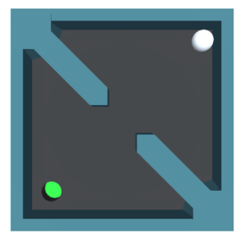

# Maze Unity
This is a graphical simulation developed in Unity based on the real world experiment from [1] and used from the [H-AI_collab_game](https://github.com/ligerfotis/maze_RL_online)

This forked from https://github.com/panos-stavrianos/MazeUnity and adjusted accordingly for our purposes.

The environment receives actions (plus other important information) and sends back observations (plus other important information) to H-AI_collab_game.

The above messages are being exchanged via an HTTP server.

H-AI_collab_game and maze_GI_Unity work as HTTP clients.

### Edit MazeUnity
* Download git
  
      git clone https://github.com/Dkoutrintzes/Maze-3d.git
  
* [Install Unity](https://docs.unity3d.com/2020.1/Documentation/Manual/GettingStartedInstallingHub.html) (Version: 2020.3.29f1)
* Open with unity
  * If Unity cannot open the project or does not recognize it, create a new project and replace the folders.
* Remove default scene
* Drag and drop main scene from Scenes in the Hierarchy

#### Add Rider in unity (Recommended for editting)
https://www.jetbrains.com/help/rider/Unity.html#getting-started

### Play

#### Prerequisites 
* Start the dedicated [Maze Server](https://github.com/panos-stavrianos/maze_server)
* Start the experiment [MazeRL](https://github.com/ligerfotis/maze_RL_online) 

#### Play in Unity Editor
Just open the game in Unity and press the `play` button.
See [here](https://github.com/ligerfotis/MazeUnity/tree/main/Assets/Scripts) for connection instructions

### MazeUnity Environment Overview

#### Dimensionality
  * Tray: 50cm x 50cm
  * Wall thickness: 3cm
  * Obstacles opening: 9 cm 
  * Ball radius: 5cm
  * Hole radius: 5 cm

### References
[1] Shafti, Ali, et al. "Real-world human-robot collaborative reinforcement learning." arXiv preprint arXiv:2003.01156 (2020).
